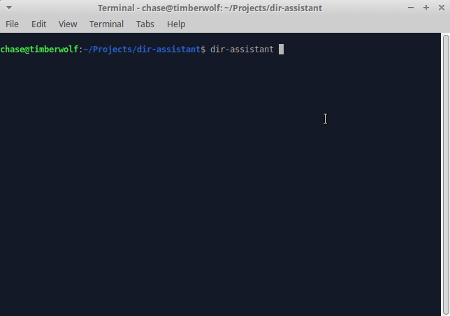

# dir-assistant

Chat with your current directory's files using a local or API LLM.



*Now with built-in RAG (Retrieval-Augmented Generation) for unlimited file count.*

This project runs local LLMs via the fantastic [llama-cpp-python](https://github.com/abetlen/llama-cpp-python) package
and runs API LLMS using the also fantastic [LiteLLM](https://github.com/BerriAI/litellm) package.

Dir-assistant has local platform support for CPU (OpenBLAS), Cuda, ROCm, Metal, OpenCL, Vulkan, Kompute, and SYCL.

Dir-assistant has API support for all major LLM APIs. More info in the 
[LiteLLM Docs](https://docs.litellm.ai/docs/providers).

## Setup

Install `pyenv` if you have not already: https://github.com/pyenv/pyenv-installer

Clone this repo then run:
```
./setup.sh
```

### For Local LLMs

The llama-cpp-python's wheel compile was quite buggy for me on both AMD and Nvidia systems I tested.
You may need to manually change the llama-cpp-python wheel compile options to make it build successfully. 
To do this, activate the virtualenv (`pyenv activate dir-assistant`) and then run `pip install llama-cpp-python==0.2.56`
with the options. Reference their install instructions for more info: https://github.com/abetlen/llama-cpp-python

Here is my working formula for a 7900XT on ROCM 6.0.2:
```
pyenv activate dir-assistant
CC=/opt/rocm/llvm/bin/clang CXX=/opt/rocm/llvm/bin/clang++ CMAKE_ARGS="-DLLAMA_HIPBLAS=on -DCMAKE_BUILD_TYPE=Release -DLLAMA_HIPBLAS=ON -DLLAMA_CUDA_DMMV_X=64 -DLLAMA_CUDA_MMV_Y=4 -DCMAKE_PREFIX_PATH=/opt/rocm -DAMDGPU_TARGETS=gfx1100" pip install --no-cache-dir --force-reinstall llama-cpp-python==0.2.56
```

## Model Download

Download your favorite LLM gguf and place it in the models directory.

You will also need to download an embedding model gguf and place it in the same directory. The embedding model is 
necessary for the RAG system to identify which files to send to the LLM with your prompt.

Note: You must always download an embedding model even while using an API LLM. The embedding model is fast and by default
runs on your CPU, so you do not need GPU support to run it.

### Recommended Models

- [Llama 3 8B Instruct](https://huggingface.co/QuantFactory/Meta-Llama-3-8B-Instruct-GGUF): The current cutting edge for
reasoning capabilities in its size class.
- [Nomic Embed Text v1.5](https://huggingface.co/nomic-ai/nomic-embed-text-v1.5-GGUF): A good low memory embedding model.

## Configure

This script should be run once when you first install `dir-assistant`, and then again whenever you would
like to modify its configuration:

```
./config.sh
```

Alternatively you can edit `config.json` once it is created.

### Local LLM configuration

Llama.cpp provides a large number of options to customize how your local model is run. Most of these options are
exposed via `llama-cpp-python`. You can configure them in `config.json` with the `DIR_ASSISTANT_LLAMA_CPP_OPTIONS`
object.

The options available are documented in the `llama-cpp-python`
[Llama constructor documentation](https://llama-cpp-python.readthedocs.io/en/latest/api-reference/#llama_cpp.Llama).

What the options do is also documented in the 
[llama.cpp CLI documentation](https://github.com/ggerganov/llama.cpp/blob/master/examples/main/README.md).

### API LLM Configuration

If you are using an API LLM via LiteLLM, you must add your API key as an environment variable. You can find the correct
environment variable name for your API key in the list of [LiteLLM providers](https://docs.litellm.ai/docs/providers).

It is convenient if you set the key's environment variable at the bottom of your `.bashrc`:

```
export GEMINI_API_KEY=your-key-here
```

However, you can also set the key while running dir-assistant:

```
GEMINI_API_KEY=your-key-here dir-assistant
```

#### Recommended API LLMs

- [Anthropic Claude 3 Haiku](https://console.anthropic.com/dashboard): Currently the best cost to performance ratio
of models with a large context size. In my testing it works quite well and costs under a cent per prompt with 30k token
context window.
  - `DIR_ASSISTANT_LITELLM_MODEL`: `anthropic/claude-3-haiku-20240307`,
  - `DIR_ASSISTANT_LITELLM_CONTEXT_SIZE`: `200000`,
  - API key environment variable: `ANTHROPIC_API_KEY`
- [Gemini 1.5 Pro](https://ai.google.dev/pricing): Currently free, but limited to two prompts per minute. One of the 
top tier models with the largest context window of 1M tokens.
  - `DIR_ASSISTANT_LITELLM_MODEL`: `gemini/gemini-1.5-pro-latest`,
  - `DIR_ASSISTANT_LITELLM_CONTEXT_SIZE`: `1000000`,
  - API key environment variable: `GEMINI_API_KEY`

## Run

First export the necessary environment variables at the start of every terminal session
(this script can be added to your `.bashrc`):

```
source /path-to/dir-assistant/export.sh
```

Then navigate to the directory you would like your LLM to see and run dir-assistant:

```
dir-assistant
```

If you'd like to ignore some files or directories, you can list them with the `--ignore` argument:

```
dir-assistant --ignore some-project-directory .git .gitignore
```

There's also a global ignore list in `config.json`.

### Running via an API LLM

On your first run using an API LLM, you may receive an error asking for an API-specific python package.
In order to install the package LiteLLM needs to run the API you have selected, you must first enter
the dir-assistant virtualenv:

```
pyenv activate dir-assistant
```

After activating the virtualenv, enter the `pip` command the error showed. For example:

```
pip install -q google-generativeai
```

## Limitations

- Only tested on Ubuntu 22.04. If you get it working on another platform, let me know.
- Dir-assistant only detects and reads text files at this time.
- This is a personal project that works for my needs but might not work for yours. If you make any adjustments so it works for you, I'd appreciate it if you made a PR.

## Todos

- ~~API LLMs~~
- ~~RAG~~
- ~~File caching (improve startup time)~~
- ~~CGRAG (Contextually-Guided Retrieval-Augmented Generation)~~
- File watching (automatically reindex changed files)
- Background indexing
- Web search
- API Embedding models
